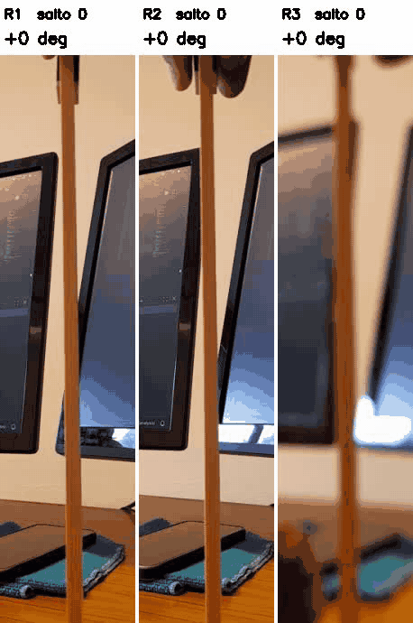
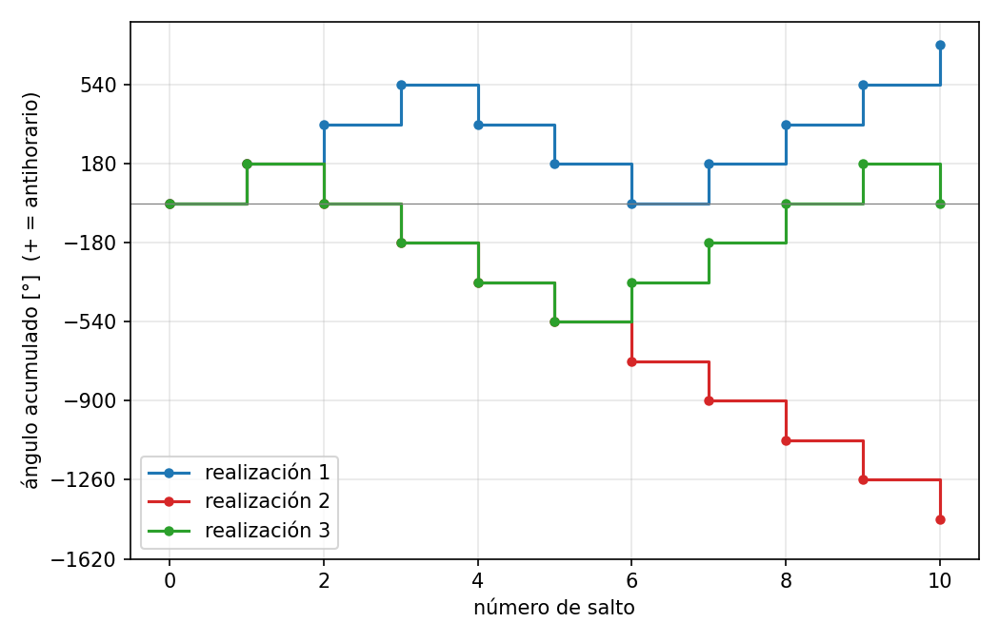

# Jueguito belga: volteretas de una pieza que baja por un palito

Una piecita de madera se coloca arriba de un palito vertical y baja a saltitos,
volteando en cada salto hacia la izquierda o hacia la derecha, en forma aparentemente
aleatoria. El experimento se filmó tres veces (`20261007_102608.mp4`, 30 fps, 1080x1920).





## Qué hace `analiza_jueguito.py`

1. **Separa las 3 realizaciones**: detecta la mano (piel / buzo rojo) en la franja del
   palito; cada tramo largo sin mano es una realización → `realizacion_{1,2,3}.mp4`.
2. **Segmenta el palito y la pieza** (a media resolución):
   - palito: píxeles de madera anaranjada + ajuste de una recta `x = a·y + b` por frame
     (compensa que la cámara está en mano);
   - pieza: diferencia entre frames consecutivos, previa corrección del temblor de cámara
     por correlación de fase, dentro de una franja alrededor del palito y excluyendo el
     palito mismo.
3. **Detecta cada salto** como una racha de frames con mucho movimiento a un costado del
   palito, y su **sentido de giro** por el lado hacia el que se abre la pieza:
   izquierda → antihorario (+180°), derecha → horario (−180°), vistos desde la cámara.
4. **Grafica** el ángulo acumulado vs número de salto para las tres realizaciones.

## Resultados

| Realización | Frames | Saltos | Secuencia | Ángulo final |
|---|---|---|---|---|
| 1 | 8–152 | 10 | ↺↺↺↻↻↻↺↺↺↺ | +720° |
| 2 | 279–427 | 10 | ↺↻↻↻↻↻↻↻↻↻ | −1440° |
| 3 | 597–747 | 10 | ↺↻↻↻↻↺↺↺↺↻ | 0° |

## Archivos

| Archivo | Contenido |
|---|---|
| `analiza_jueguito.py` | el análisis completo |
| `serie_realizacion_{k}.csv` | por salto: frames, tiempo, lado, sentido (±1), ángulo acumulado, confianza |
| `angulo_vs_salto.png` | ángulo acumulado vs salto, 3 realizaciones |
| `realizacion_{k}.mp4` | el video cortado por realización |
| `segmentacion_realizacion_{k}.mp4` | control a media velocidad: palito (verde), píxeles de la pieza (rojo durante un salto), número y sentido de cada salto |
| `check_realizacion_{k}.jpg` | un recorte por salto con el sentido detectado |
| `hace_gif.py` → `realizaciones.gif` | las 3 realizaciones lado a lado (media velocidad), con nº de salto, ángulo acumulado y CW/CCW |

## Uso

```bash
pip install opencv-python numpy matplotlib   # y ffmpeg en el PATH
python3 analiza_jueguito.py 20261007_102608.mp4
python3 hace_gif.py                 # usa los CSV generados por el anterior
```

Si algún sentido está mal detectado se corrige a mano con el diccionario `OVERRIDE`
al principio del script, p.ej. `OVERRIDE = {(3, 6): -1}` (realización 3, salto 6).

## Limitaciones

- A 30 fps una voltereta dura 2–6 frames, con mucho motion blur.
- La pieza a veces se abre hacia ambos lados del palito; el sentido se decide por el lado
  dominante. Los saltos con confianza < 0.8 se marcan para revisar
  (R2 salto 1, R3 saltos 4 y 6).
- El primer salto de cada realización ocurre mientras los dedos todavía están en cuadro.

## Consejos para filmar nuevos videos

Para que el análisis automático sea más confiable (y poder juntar muchos videos para
hacer estadística de las caminatas angulares):

- **Cámara fija** (trípode o apoyada): ahora se compensa el temblor, pero agrega ruido.
- **Más fps** si el celular lo permite (60 o 120 en cámara lenta): a 30 fps una voltereta
  dura 2–6 frames y sale muy movida.
- **Fondo liso y claro detrás del palito** (por ejemplo una cartulina): el monitor oscuro
  se confunde con las partes negras de la pieza.
- **Mismo encuadre siempre**, con todo el palito visible.
- **Soltar la pieza y sacar la mano rápido**: el primer salto ocurre con los dedos todavía
  en cuadro.
